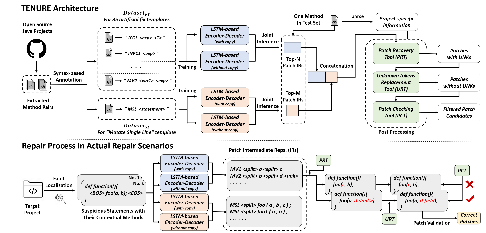

# TENURE (Template-based Neural Program Repair)


I. Requirements
--------------------
 #### For TENURE:
 - [Java 11](https://www.oracle.com/java/technologies/javase/jdk11-archive-downloads.html)
 - [Python 3.6.8](https://www.python.org/downloads/)
 - [PyTorch-1.6.0](https://pytorch.org/)
 
 
 #### For Defects4J-v1.2 dataset:
 - [Defects4J 1.2](https://github.com/rjust/defects4j/releases/tag/v1.2.0)
 - [Java 1.7](https://www.oracle.com/technetwork/java/javase/downloads/)
 - [SVN >= 1.8](https://subversion.apache.org/packages.html)
 - [Git >= 1.9](https://git-scm.com/)
 - [Perl >= 5.0.10](https://www.perl.org/get.html)
 
 
 #### For Defects4J-v2.0 dataset:
 - [Defects4J 2.0](https://github.com/rjust/defects4j/releases/tag/v2.0.0)
 - [Java 1.8](https://www.oracle.com/technetwork/java/javase/downloads/)
 - [SVN >= 1.8](https://subversion.apache.org/packages.html)
 - [Git >= 1.9](https://git-scm.com/)
 - [Perl >= 5.0.10](https://www.perl.org/get.html)
 
 


II. Overview of TENURE
--------------------




III. Download Dataset
---------------------------
1. Click the following url links and download the necessary data used in this work.

    [fault_localization.tar.gz](https://mega.nz/file/r9AV3boa#t19Ny26r2qywoAVtv9MyAz6E8ORa_s-0X00E_6vOj2M)
    
    [check_point.tar.gz](https://mega.nz/file/yoxBADqS#3xeoJ5PtU4pZ7zIQLz-1p1okv338MGEysTyLERO-ABY)
    
    [dataset.tar.gz](https://mega.nz/file/expBgb6D#7eK8hKEywiwIPc8MoiTNa__4blkkMkqP1aMtIDioRkI)
    
    [third_party_v1.tar.gz](https://mega.nz/file/W85zDJpS#BasF13wiD-k54mA35WzjckI8MVz6HLBvn_VDTVirCzY)
    
    [third_party_v2.tar.gz](https://mega.nz/file/zh4igRLS#oLgBXfhzxb8FCCzkGfqHG-n5meK3vPby3xnx0vW_PkI)

    [JDK_1.7.tar.gz](https://mega.nz/file/C5pmFRKJ#sG8WnPeXUFVXPFnzbLN90dC3liMaldX-ztDl6Bf_pe0)

    [JDK_1.8.tar.gz](https://mega.nz/file/2woFEJQY#DJ2h0moZlp4y_RiEBfspoCpFJ4y6e1ys46lI0L9SM5E)
    
    

2. Put them into the corresponding paths as follows and decompress them: 
    * Put `fault_localization.tar.gz` into the root dir of TENURE.
    * Put `check_point.tar.gz` into `./nmt_model/origin_onmt/`.
    * Put `dataset.tar.gz` into `./nmt_model/`.
    * Put `third_party_v1.tar.gz` into `./necessary_info/d4j_v1/`.
    * Put `third_party_v2.tar.gz` into `./necessary_info/d4j_v2/`.
    * Put `JDK_1.7.tar.gz` into `./necessary_info/d4j_v1/`.
    * Put `JDK_1.8.tar.gz` into `./necessary_info/d4j_v2/`.
    


IV. Prepare Defects4J Dataset
---------------------------
 1. Download and install [Defects4J-v1.2](https://github.com/rjust/defects4j/releases/tag/v1.2.0) and [Defects4J-v2.0](https://github.com/rjust/defects4j/releases/tag/v2.0.0), and complete the requirements in their README file.
  
 3. Export environment variable `D4J_HOME` as the root dir of Defects4J (select the corresponding Defects4J version according to the experiment settings).
 

V. Perform Repair Experiments with Already Trained Models
 --------------------------
1. Edit the confiauration (./config.txt) of the experiments if you want. 

```
  <d4j_version>: v1 or v2
  <fl_setting>: perfect or ochiai
  <bug_version>: a bug from Defects4J-v1.2 or Defects4J-v2.0 (e.g., Chart_1)
  <beam_all>: the number of reserved patch IRs from 35 artificial fix templates and 1 single-line fix template (default: 500 for perfect and 200 for ochiai)
  <beam_35>: the number of reserved patch IRs from 35 artificial fix template (default: 300 for both perfect and ochiai)
  <beam_single>: the number of reserved patch IRs from the single-line fix template (default: 200 for both perfect and ochiai)
```
    
2. Enter the path `./projects/d4j_<d4j_version>/` and checkout the corresponidng bug version (e.g. Chart_1) in Defects4J-v1.2 or Defects4J-v2.0 (use Java JDK 1.7 or 1.8).
``` 
  e.g. defects4j checkout -p Chart -v 1b -w ./Chart_1
```
3. Execute `data_process.jar` (must use Java JDK 11).
```
  cd ./scripts/ && java -jar data_process.jar <d4j_version> <bug_version> <fl_setting>
```
4. Execute `run.py` (use Java JDK 1.7 or 1.8).
```
  cd ./scripts/ && python3 run.py
```
5. See the repair results in `./patch_validation/patches/` and the repair log in `./patch_validation/log/`.
```
  ./patch_validation/patches/all/: including the patches that can pass all test cases.
  ./patch_validation/patches/partial/: including the patches that can pass part of the test cases.
```
6. Manual check for these patches to judge if they are semantically correct.

* Note_1: we recommend executing the script `init.py` in `./scripts/` to restore the source code of the bug version to be fixed in Defects4J dataset to the original state.
* Note_2: if you want to obtain experimental results for multiple bug versions in one execution, try running `./gen_config.py` and `run_batch.py` in the root directory.  


VI. Train New Models to Perform Repair Experiments
---------------------------
If you want to train new models for repair experiments, the following steps can help:
1. Use the configuration files in `./nmt_model/origin_onmt/train/` for model training.
```
  Vocabulary construction (e.g.): cd ./nmt_model/origin_onmt/ && python3 build_vocab.py -config ./train/config-copy-35.yaml -n_samples -1
  Model Training (e.g.): cd ./nmt_model/origin_onmt/ && python3 train.py -config ./train/config-copy-35.yaml
```

2. Select a new model checkpoint to replace the original one procided by us.
```
  (e.g.) cd ./nmt_model/origin_onmt/check_point/copy_35/ && mv model_step_200000.pt saved_model.pt
```
        
3. Execute all the commands in Section V.

* Note: gpu options can be edited in the configuration files in `./nmt_model/origin_onmt/train/` to meet the requirements of different operating environments.


VII. Online Appendix
-----------------------------

### 1. Twelve error-oriented functional modules designed in PCT:

| Module Names | Descriptions |
|:------------|:----------|
| Check Identifiers | Check if all identifiers can be found in the space of syntactic constraints. |
| Check Method Param. | Check if the types of method params are consistent with the declaration. |
| Check Binary Operations | Check if the operands in binary expressions satisfy the type restrictions. |
| Check Unary Operations | Check if the operand in unary expressions satisfy the type restrictions. |
| Check Array Indices | Check if the index of an array is a non-negative integer. |
| Check Assignments | Check if the types of expressions on the left and right sides of "=" are the same. |
| Check Continues & Breaks | Check if continue and break statements in a loop. |
| Check Return Types | Check if the actual return type is consistent with that of method declaration. |
| Check Basic Type References | Check if a code element of a basic type is (incorrectly) referenced. |
| Check Cast Types | Check if the identifier used in a cast expression is a class name. |
| Check Conditional Expr. | Check if the condition is a boolean type expression. |
| Check Unreachable Stmt. | Check if there is a statement that can never be reached. |

---

### 2. More Explanations for 36 (35+1) Fix Templates and The Corresponding Patch IRs.

| No. | Fix Templates | Definitions of Repair Actions | Patch IRs|
|:------------:|:----------|:------------|:----------|
| 1 | Insert Cast <br> Checker 1 | + &emsp; if (***exp*** instanceof ***T***){<br>&emsp;&emsp;&emsp;&emsp; var = (***T***) ***exp*** ; <br> + &emsp; } | ICC1 \<exp\> \<T\> |
| 2 | Insert Null Pointer <br> Checker 1 | + &emsp; if (***exp*** != null){<br>&emsp;&emsp;&emsp;&emsp; ... ***exp*** ... ;<br> + &emsp; } | INPC1 \<exp\> |
| 3 | Insert Null Pointer <br> Checker 2 | + &emsp; if (***exp*** == null)<br>+ &emsp;&emsp;&emsp; return ***default*** ; <br>&emsp;&emsp; ... ***exp*** ... ; | INPC2 \<exp\> \<default\> |
| 4 | Insert Null Pointer <br> Checker 3 | + &emsp; if (***exp*** == null)<br>+ &emsp;&emsp;&emsp; ***exp*** = ***exp1*** ; <br>&emsp;&emsp; ... ***exp*** ... ; | INPC3 \<exp\> \<exp1\> |
| 5 | Insert Null Pointer <br> Checker 4 | + &emsp; if (***exp*** == null)<br>+ &emsp;&emsp;&emsp; continue ; <br>&emsp;&emsp; ... ***exp*** ... ; | INPC4 \<exp\> |
| 6 | Insert Null Pointer <br> Checker 5 | + &emsp; if (***exp*** == null)<br>+ &emsp;&emsp;&emsp; throw new <br> + &emsp;&emsp;&emsp; IllegalArgumentException(...) ; <br>&emsp;&emsp; ... ***exp*** ... ; | INPC5 \<exp\> |
| 7 | Insert Range <br> Checker 1 | + &emsp; if (***index*** &lt; ***exp***.length){<br>&emsp;&emsp;&emsp;&emsp; ... ***exp***\[***index***\] ... ; <br> + &emsp; } | IRC1 \<exp\> \<index\> |
| 8 | Insert Range <br> Checker 2 | + &emsp; if (***index*** &lt; ***exp***.size()){<br>&emsp;&emsp;&emsp;&emsp; ... ***exp***.get(***index***) ... ; <br> + &emsp; } | IRC2 \<exp\> \<index\> |
| 9 | Insert Missed <br> Statement 1 | + &emsp; ***expression_statement*** ; | IMS1 \<expression_statement\> |
| 10 | Insert Missed <br> Statement 2 | + &emsp; return ***default*** ; | IMS2 \<default\> |
| 11 | Insert Missed <br> Statement 3 | + &emsp; try{<br>&emsp;&emsp;&emsp;&emsp; statement ; ... <br> + &emsp; catch (Exception e) { ... } | IMS3 |
| 12 | Insert Missed <br> Statement 4 | + &emsp; if (***conditional_exp***){<br>&emsp;&emsp;&emsp;&emsp; statement ; ... <br> + &emsp; } | IMS4 \<conditional_exp\> |
| 13 | Remove Buggy <br> Statement 1 | &emsp;&emsp;...... <br> - &emsp; statement ; <br>&emsp;&emsp;...... | RBS1 |
| 14 | Move <br> Statement 1 | - &emsp; statement ; <br>&emsp;&emsp;......(***move_step***) <br>+ &emsp;statement ;| MS1 \<move_step\> |
| 15 | Mutate <br> Conditional <br> Expression 1 | - &emsp; ... ***cExpr1*** ... ; <br> + &emsp;... ***cExpr2*** ... ; | MCE1 \<cExp1\> \<cExp2\> |
| 16 | Mutate <br> Conditional <br> Expression 2 | - &emsp; ... cExpr1 ***op*** ***cExpr2*** ... ; <br> + &emsp;... cExpr1 ... ; | MCE2 \<op\> \<cExp2\> |
| 17 | Mutate <br> Conditional <br> Expression 3 | - &emsp; ... ***cExpr1*** ... ; <br> + &emsp;... ***cExpr1*** ***op*** ***cExpr2*** ... ; | MCE3 \<cExp1\> \<op\> \<cExp2\> |
| 18 | Mutate <br> Class Instance <br> Creation 1 |&emsp;&emsp;public Object clone(){ <br> - &emsp;&emsp;&emsp; ... new T() ; <br> + &emsp;&emsp;&emsp;(T) super.clone() ; <br>&emsp;&emsp; } | MCIC1 |
| 19 | Mutate Data <br> Type 1 | - &emsp; ***T1*** var ... ; <br> + &emsp;***T2*** var ... ; | MDT1 \<T1\> \<T2\> |
| 20 | Mutate Data <br> Type 2 | - &emsp; ... (***T1***) exp ... ; <br> + &emsp;... (***T2***) exp ... ; | MDT2 \<T1\> \<T2\> |
| 21 | Mutate Integer <br> Division <br> Operation 1 | - &emsp; ... dividend / ***divisor*** ... <br> + &emsp;... dividend / (double or float) ***divisor*** ... | MIDO1 \<divisor\> |
| 22 | Mutate Integer <br> Division <br> Operation 2 | - &emsp; ... ***dividend*** / divisor ... <br> + &emsp;... (double or float) ***dividend*** / divisor ... | MIDO2 \<dividend\> |
| 23 | Mutate Integer <br> Division <br> Operation 3 | - &emsp; ... ***dividend*** / ***divisor*** ... <br> + &emsp;... (1.0 / ***divisor***) \* ***dividend*** ... | MIDO3 \<dividend\> \<divisor\> |
| 24 | Mutate Literal <br> Expression 1 | - &emsp; ... ***literal1*** ... <br> + &emsp;... ***literal2*** ... | MLE1 \<literal1\> \<literal2\> |
| 25 | Mutate Literal <br> Expression 2 | - &emsp; ... ***literal1*** ... <br> + &emsp;... ***exp*** ... | MLE2 \<literal1\> \<exp\> |
| 26 | Mutate Method <br> Invocation <br> Expression 1 | - &emsp; ... ***method1***(args) ... <br> + &emsp;... ***method2***(args) ... | MMIE1 \<method1\> \<method2\> |
| 27 | Mutate Method <br> Invocation <br> Expression 2 | - &emsp; ... method1(arg1, ***arg2***, ***arg3***, ...) ... <br> + &emsp;... method1(arg1, ***arg4***, ***arg5***, ...) ... | MMIE2 \<\[arg2, arg3\]\> \<\[arg4, arg5\]\> |
| 28 | Mutate Method <br> Invocation <br> Expression 3 | - &emsp; ... method1(arg1, ***arg2***, ***arg3***, ...) ... <br> + &emsp;... method1(arg1, ...) ... | MMIE3 \<\[arg2, arg3\]\> |
| 29 | Mutate Method <br> Invocation <br> Expression 4 | - &emsp; ... method1(***arg2***, ***arg4***, ...) ... <br> + &emsp;... method1(***arg1***, ***arg2***, ***arg3***, ***arg4***, ...) ... | MMIE4 \<\[arg2, arg4\]\> \<\[arg1, arg3\]\>|
| 30 | Mutate <br> Operators 1 | - &emsp; ... exp1 ***op1*** exp2 ... <br> + &emsp;... exp1 ***op2*** exp2 ... | MO1 \<op1\> \<op2\> |
| 31 | Mutate <br> Operators 2 | - &emsp; ... (***exp1 op1 exp2***) op2 exp3 ... <br> + &emsp;... exp1 op1 (***exp2 op2 exp3***) ... | MO2 \<exp1 op1 exp2\> \<exp2 op2 exp3\> |
| 32 | Mutate <br> Operators 3 | - &emsp; ... ***exp*** instanceof ***T*** ... <br> + &emsp;... ***exp*** != null ... | MO3 \<exp\> \<T\> |
| 33 | Mutate Return <br> Statement 1 | - &emsp; return ***exp1*** ; <br> + &emsp;return ***exp2*** ; | MRS1 \<exp1\> \<exp2\> |
| 34 | Mutate <br> Variable 1 | - &emsp; ... ***var1*** ... <br> + &emsp;... ***var2*** ... | MV1 \<var1\> \<var2\> |
| 35 | Mutate <br> Variable 2 | - &emsp; ... ***var1*** ... <br> + &emsp;... ***exp*** ... | MV2 \<var1\> \<exp\> |
| 36 | Mutate <br> Single Line | - &emsp; before_statement ; <br> + &emsp;***after_statement*** ; | MSL \<after_statement\> |

---

### 3. Top-2000 Java Projects Used in TENURE.

After careful checking, 8 projects exist in both Top-2000 projects and Defects4J (v1.2 & v2.0) dataset, so the remaining 1992 projects are used in TENURE, which are listed in the file [top-2000-projects.txt](https://github.com/mxx1219/TENURE/blob/master/top-2000-projects.txt).

---


VIII. Structure of the Directories
 -------------------------------
 ```
  |--- README.md                :  user guidance
  |--- overview.png             :  overview of TENURE
  |--- fault_localization       :  fault localization results (perfect or ochiai)
  |--- projects                 :  the source code of bug versions in Defects4J
  |--- necessary_info           :  some necessary information used in experiments
  |--- parsed_data              :  intermediate data in the process of patch generation
  |--- tool_set                 :  tools developed in post processing phase (prt, urt, pct)
  |--- nmt_model                :  encoder-decoder models with joint interface strategy
  |--- scripts                  :  scripts to complete some tasks such as data preprocessing
  |--- patch_validation         :  main entrance for patch validations
  |--- repair_result            :  correct patches generated by TENURE
  |--- config.txt               :  configuration file required for single processing
  |--- configs                  :  configuration files required for batch processing
  |--- gen_config.py            :  python script for generating config files in ./configs
  |--- run.py                   :  single version validation for repair experiments (related to ./config.txt)
  |--- run_batch.py             :  batch validation for repair experiments (related to ./configs)
  |--- top-2000-projects.txt    :  projects used for large-scale dataset construction
  |--- paper.pdf                :  paper of icse 2023


```
